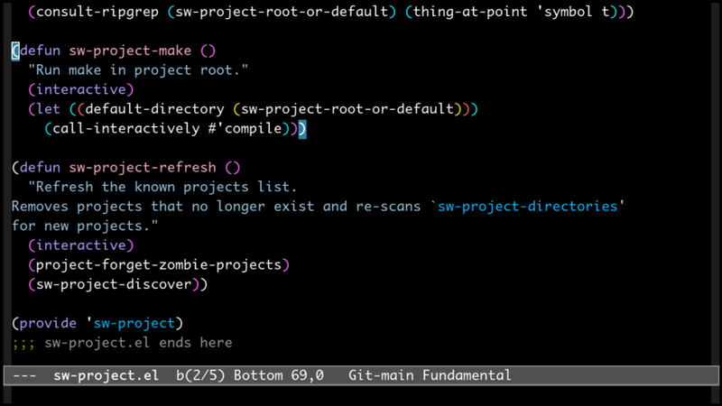
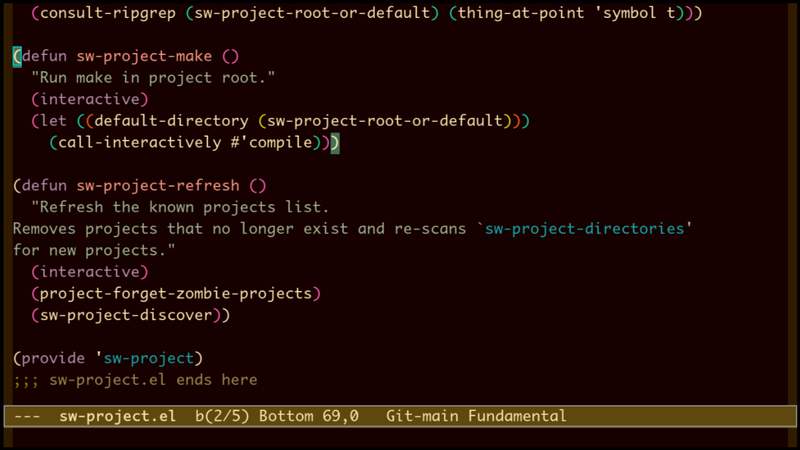
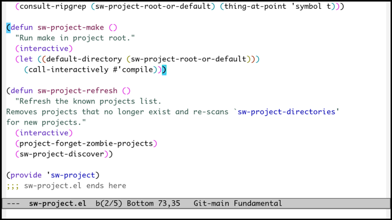
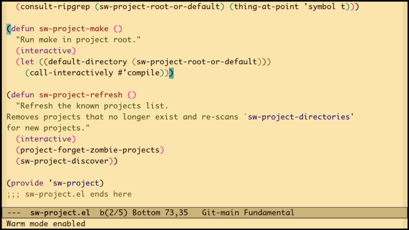
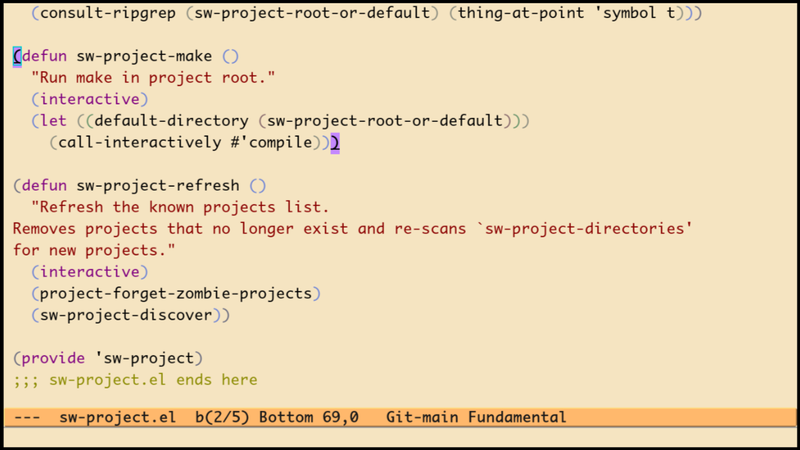
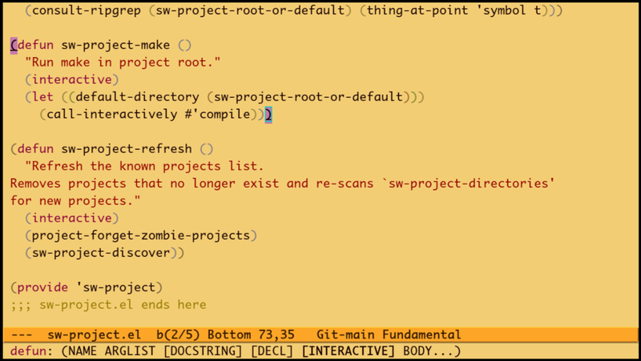

# warm-mode.el

A global minor mode that warms Emacs colors for nighttime coding. Reduces blue
light and slightly dims colors across all faces, working with any theme.

An alternative is to switch to a different theme at night, but warm-mode
preserves your exact color scheme, just making it warmer. This makes it easier
to adapt without losing familiarity with your theme.

## Screenshots

Examples using `warm-mode-warmth` 0.25 and `warm-mode-dim` 0.9.

**modus-vivendi**
| Disabled | Enabled |
|----------|---------|
|  |  |

**modus-operandi**
| Disabled | Enabled |
|----------|---------|
|  |  |

**creamy**
| Disabled | Enabled |
|----------|---------|
|  |  |

## Installation

### Manual

Clone this repository and add to your `load-path`:

```elisp
(add-to-list 'load-path "/path/to/emacs-warm-mode")
(require 'warm-mode)
```

## Usage

Toggle warm mode:

```
M-x warm-mode
```

## Customization

| Variable                     | Default                               | Description                              |
|------------------------------|---------------------------------------|------------------------------------------|
| `warm-mode-warmth`           | 0.2                                   | Intensity of warm shift (0.0 to 0.5)     |
| `warm-mode-dim`              | 0.9                                   | Brightness multiplier (0.5 to 1.0)       |
| `warm-mode-refresh-packages` | See `warm-mode-refresh-packages`      | Common deferred packages that auto-refresh faces on load |

Example configuration:

```elisp
(use-package warm-mode
  :ensure (:host github :repo "smallwat3r/emacs-warm-mode")
  :custom
  (warm-mode-warmth 0.25)
  (warm-mode-dim 0.9)
  :config
  ;; Add extra packages to refresh list
  (warm-mode-add-refresh-package 'treemacs 'vertico))
```

To override the default package list entirely, set it before loading:

```elisp
(use-package warm-mode
  :ensure (:host github :repo "smallwat3r/emacs-warm-mode")
  :init
  (setq warm-mode-refresh-packages '(magit org corfu))
  :custom
  (warm-mode-warmth 0.25))
```

## Limitations

1. Faces defined after enabling warm-mode will not be transformed. Common
   packages are handled automatically via `warm-mode-refresh-packages`. For
   other packages, use `warm-mode-add-refresh-package` or manually toggle
   warm-mode after loading them.

2. Only foreground and background colors are transformed. Attributes like
   `:underline` or `:box` usually inherit from foreground, so they are
   effectively warmed. However, if a theme explicitly sets a color for these
   attributes, that color will not be transformed.

3. The mode is global and cannot be enabled per-frame.

4. The warming algorithm is simple and not a proper color temperature shift like
   f.lux or Redshift. Results may vary depending on your theme.

5. May not change text colors in terminal Emacs where color support is limited.
