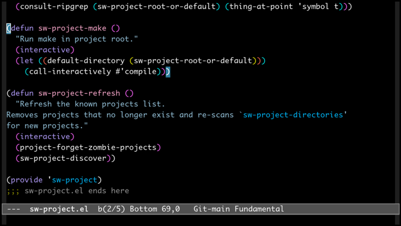
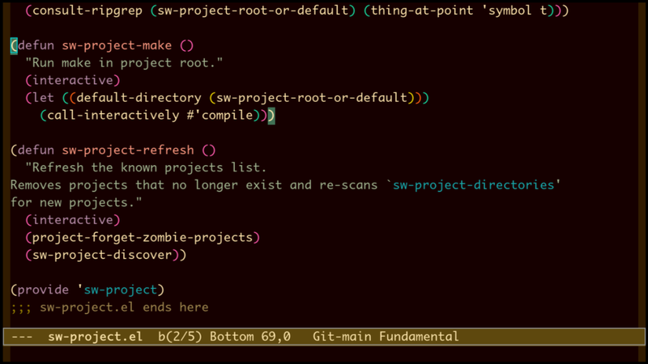
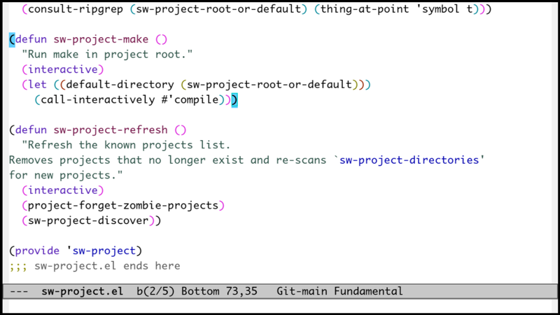
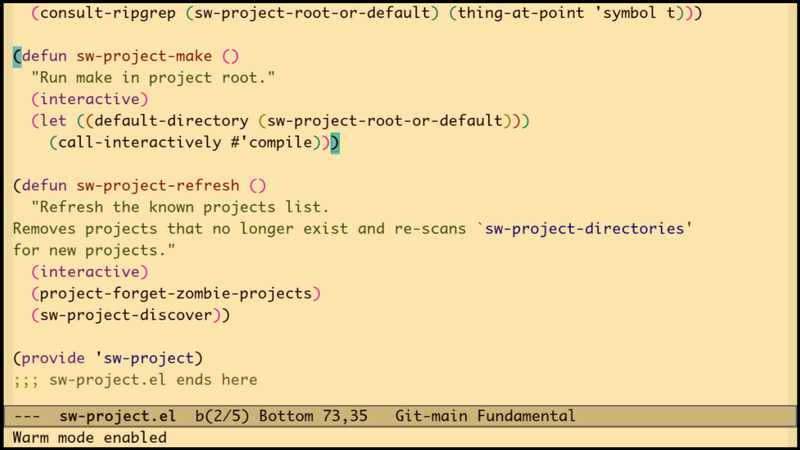
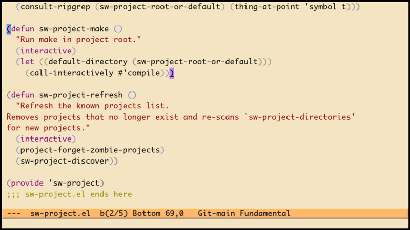
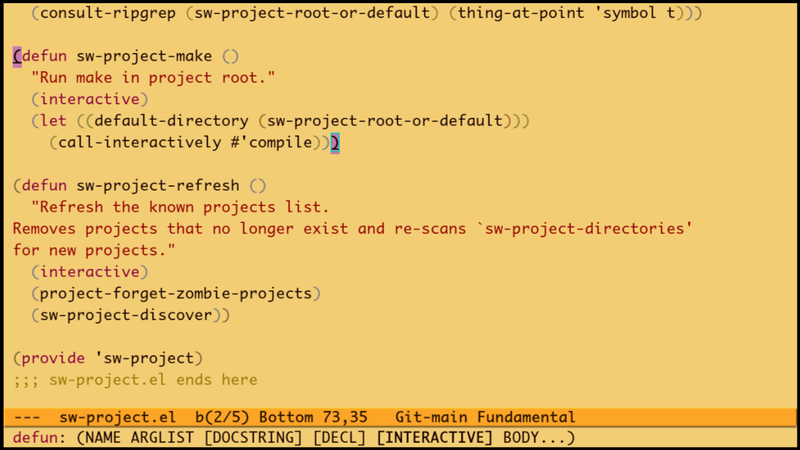

# warm-mode.el

[](https://melpa.org/#/warm-mode)

A global minor mode that warms Emacs colors for nighttime coding. Reduces blue
light and slightly dims colors across all faces, working with any theme.

## Why

System-wide tools like [wlsunset](https://sr.ht/~kennylevinsen/wlsunset/)
apply a blue light filter to your entire screen. warm-mode is useful when you
only want the effect in Emacs, leaving other applications unaffected. It also
works cross-platform, unlike most system-wide tools. You could
also combine both for extra warmth.

Another alternative is to switch to a different theme at night, but warm-mode
preserves your exact color scheme, just making it warmer. This makes it easier
to adapt without losing familiarity with your theme.

## Screenshots

Examples using `warm-mode-warmth` 0.25 and `warm-mode-dim` 0.9.

**modus-vivendi**
| Disabled | Enabled |
|----------|---------|
|  |  |

**modus-operandi**
| Disabled | Enabled |
|----------|---------|
|  |  |

**creamy**
| Disabled | Enabled |
|----------|---------|
|  |  |

## Installation

Available on [MELPA](https://melpa.org/#/warm-mode). Using
[use-package](https://github.com/jwiegley/use-package):

```elisp
(use-package warm-mode
  :ensure t)
```

Or from source with use-package's `:vc` (Emacs 30):

```elisp
(use-package warm-mode
  :vc (:url "https://github.com/smallwat3r/emacs-warm-mode"))
```

Or with [Elpaca](https://github.com/progfolio/elpaca):

```elisp
(use-package warm-mode
  :ensure (:host github :repo "smallwat3r/emacs-warm-mode"))
```

Or manually, clone this repository and add to your `load-path`:

```elisp
(add-to-list 'load-path "/path/to/emacs-warm-mode")
(require 'warm-mode)
```

## Usage

Toggle warm mode:

```
M-x warm-mode
```

## Customization

| Variable | Default | Description |
|----------|---------|-------------|
| `warm-mode-warmth` | 0.2 | Intensity of warm shift (0.0 to 0.5) |
| `warm-mode-dim` | 0.9 | Brightness multiplier (0.5 to 1.0) |

Example configuration:

```elisp
(use-package warm-mode
  :ensure t
  :custom
  (warm-mode-warmth 0.25)
  (warm-mode-dim 0.9))
```

## Limitations

1. Only foreground and background colors are transformed. Attributes like
   `:underline` or `:box` usually inherit from foreground, so they are
   effectively warmed. However, if a theme explicitly sets a color for these
   attributes, that color will not be transformed.

2. The mode is global and cannot be enabled per-frame.

3. The warming algorithm is simple and not a proper color temperature shift like
   f.lux or Redshift. Results may vary depending on your theme.

4. May not change text colors in terminal Emacs where color support is limited.

5. When using `desktop-save-mode` some frame colors may not be properly restored
   after an Emacs restart. The easiest way to prevent this is to avoid storing
   them in the desktop session:
   ```elisp
   ;; Don't let desktop-save-mode persist frame color params, they can be left
   ;; stale if Emacs quits while warm-mode is active.
   (dolist (param '(foreground-color background-color cursor-color))
     (push (cons param :never) frameset-filter-alist))
   ```

6. Faces defined with `defface`, set with `custom-set-faces` or changed by a
   theme are warmed as they appear. Colors changed directly with
   `set-face-attribute` while the mode is on are picked up on the next theme
   change or toggle.
